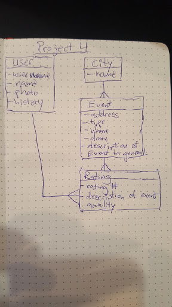

#  Project4 : What Hot
## Project Description

The aim of this assignment was to make a game that would let the user to view and rate the live events of the city of Atlanta. The user can view each event and see a live rating of the people who are there. Then if they make an account they can post a comment as well on how the event is to them. 

## Technologies Used

  * Languages - HTML5, CSS3, React, Rails 
  * Wireframe - Balsamiq
  * Project Planning & User Stories - [Trello](https://trello.com/b/0j1ykoL9/project-4)
  * Visual Studio Code
  * iTerm

## Features

  * View ratings
  * Make rating

  
  
